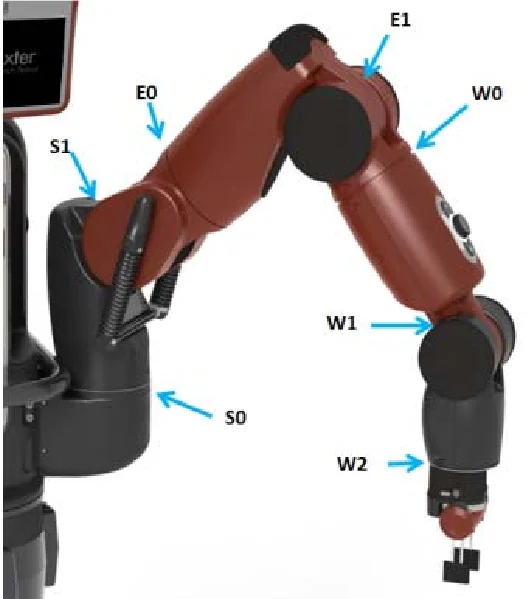

# BRUNO — Music-Synchronized Robot Motion

**B**axter **R**obot **U**nbelievably **N**atural **O**nstage

A dancing robot system that automatically extracts beats from an audio track and synchronizes Baxter's arm movements to the music using a custom PID controller, simulated in robosuite/MuJoCo.

## Robot
- **Robot:** Baxter (dual-arm, 14 DOF)
- **Gripper:** Robotiq85
- **Simulation:** robosuite + MuJoCo
- **Dance style inspiration:** Tutting and Voguing
- **Song:** Uptown Funk — Bruno Mars

## Project Structure
```
├── main.py               # runs the full dancing simulation
├── beat_detection.py     # extracts BPM and beat timestamps using librosa
├── choreography.py       # maps beat timestamps to pose sequences
├── pose_library.py       # 60+ tutting poses as 14D joint angle arrays
├── pid_controller.py     # custom PID controller for joint position control
├── env_setup.py          # robosuite environment setup
├── custom_env.py         # custom empty environment with disco lighting
├── baxter_joint_pos.json # absolute joint position controller config
├── assets/
│   └── uptown_funk.mp3   # audio file (not included, see Setup)
└── index.html            # project website
```

## Dependencies
```bash
pip install robosuite
pip install librosa
pip install pygame
pip install numpy
```

## Setup
1. Download an mp3 of "Uptown Funk" by Bruno Mars and save it as `assets/uptown_funk.mp3`
2. Activate your robosuite conda environment
3. Run the simulation:
```bash
mjpython main.py
```

## How It Works
1. **Beat Detection** — librosa extracts BPM and beat timestamps from the audio file
2. **Choreography** — each beat timestamp is mapped to a tutting pose from the pose library
3. **PID Control** — a custom PID controller drives Baxter's 14 arm joints toward each target pose
4. **Synchronization** — pose transitions are triggered at detected beat timestamps, keeping motion aligned to the music

## Results
| Metric | Value | Target | Status |
|---|---|---|---|
| Timing accuracy (±50ms) | 100% | 80% | Pass |
| Mean timing error | +1.6ms | -- | -- |
| Poses settled <200ms | 91.7% | 70% | Pass |
| Mean settling time | 128ms | <200ms | Pass |

## CS 188 — UCLA Winter 2026
<a href="https://www.researchgate.net/figure/The-7-joints-of-the-Baxter-robot-arm-Joints-S0-S1-comprise-the-shoulder-E0-E1-the_fig2_346549361">

</a>

*Figure 1: The 7 joints of the Baxter robot arm. Joints S0, S1 comprise the shoulder, E0, E1 the elbow, and W0, W1, W2 the wrist. Source: [1]*

## References  
[1] Model-Based Reinforcement Learning For Robot Control - Scientific Figure on ResearchGate. Available from: https://www.researchgate.net/figure/The-7-joints-of-the-Baxter-robot-arm-Joints-S0-S1-comprise-the-shoulder-E0-E1-the_fig2_346549361 [accessed 20 Mar 2026]
